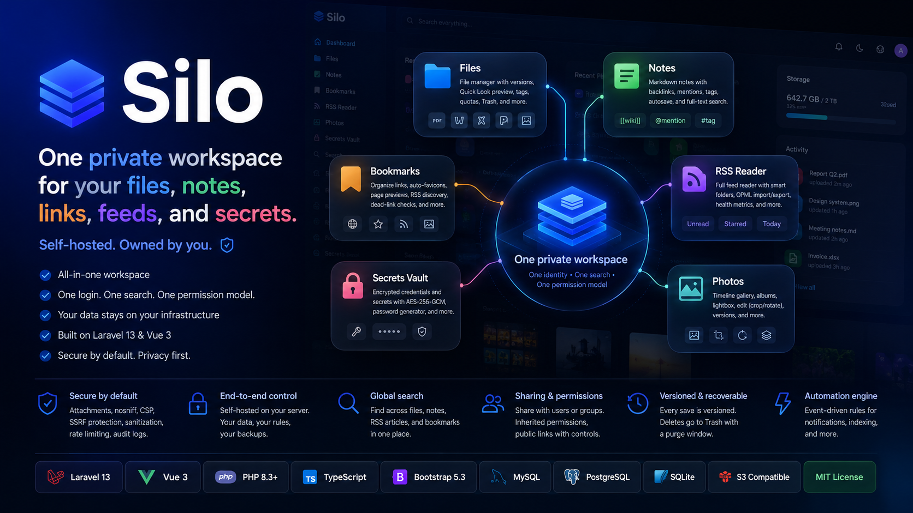
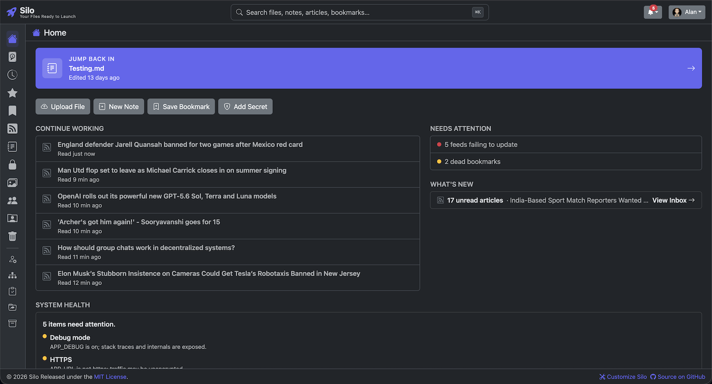

<div align="center">



[](https://github.com/velkymx/laravel-file-manager/actions/workflows/ci.yml)
[](#quick-start-with-docker-recommended)
[](https://laravel.com/)
[](https://www.php.net/)
[](https://vuejs.org/)
[](https://getbootstrap.com/)
[](https://www.typescriptlang.org/)
[](LICENSE)

</div>

# Silo

**One private workspace for your files, notes, links, feeds, and secrets. Self-hosted, owned by you.**

### What it is

Silo is a self-hosted workspace that replaces a stack of separate cloud services with one app on your own server. Files, notes, bookmarks, an RSS reader, an encrypted secrets vault, and a photo gallery all live behind a single login, in your database, on your storage. Nothing leaves your infrastructure.

### How it works

The surfaces are not bolted together. They share one identity, one permission model, one global search, and one automation engine. Save a file and it is versioned. Star an article and it appears next to your starred files. Bookmark a page and Silo can detect its RSS feed and offer to subscribe. Grant a teammate access to a folder and every file inside inherits it. You run it on Laravel 13 and Vue 3 with MySQL, MariaDB, Postgres, or SQLite and a local or S3 disk, plus one queue worker for background processing.

### Why it holds up

Silo is built for real use, not a demo. Every action is permission-checked and sensitive ones are audit-logged. Uploads are processed in the background for thumbnails and metadata, and optionally virus-scanned before they are served. File bodies are served safely (attachment plus nosniff plus a strict Content-Security-Policy), feed and article HTML is sanitized before render, every server-side URL fetch is SSRF-guarded, and secrets are encrypted at rest with authenticated AES-256-GCM. Saves are versioned and deletes are recoverable from Trash.

### Who it is for

Teams, self-hosters, agencies, privacy-sensitive organizations, and homelabs that want an all-in-one workspace on their own hardware instead of renting five SaaS subscriptions and trusting each one with their data.

---



## What's inside

### Home screen

Logging in lands on a home screen built to get you back to work in seconds: a **Jump Back In** button for the file or note you last edited, **Quick Actions** (Upload File, New Note, Save Bookmark, Add Secret), a **Continue Working** list of recently touched items mixed across every surface, **What's New** (your unread RSS), and a quiet **Needs Attention** card that only speaks up when something is wrong (failed scans, expiring shares, dead bookmarks, storage nearly full). Admins also get a **System Health** card: management-by-exception operational checks (runtime, security, features, maintenance, backup freshness and destination) plus an opt-in, cached Silo update check that never phones home unless enabled.

### Files

A file manager with a thumbnail grid, a list, or a lazy tree explorer that shows folders and files inline. Drag-and-drop multi-file upload and transactional move, copy, rename, and delete keep the tree and disk in sync. **Quick Look** previews images, PDFs, audio, video, Markdown, Office documents, and text with arrow-key paging. **In-browser editing** covers Markdown, HTML, Word (`.docx`), and spreadsheets (`.xlsx`, `.xls`, `.csv`, `.ods`) with live formulas (see [Editing files](#editing-files)). Every save is versioned with an optional change note. Colored tags and starring filter in one click, deletes go to Trash with a purge window, and per-user quotas come with a usage meter and a storage treemap.

### Notes

A Markdown notes surface with folders, `[[wiki-style]]` backlinks, `@mentions`, tags, autosave that snapshots versions, and full-text search. A private, linkable knowledge base that lives next to your files.

### Bookmarks (Launchpad)

An internal link catalog organized into folders, with auto-fetched favicons, optional self-hosted page-preview screenshots, dead-link detection, RSS-feed auto-discovery with one-click subscribe, browser-export import, and de-duplication. Bookmarks are personal by default; mark one shared to publish it to the whole team.

### RSS reader

A complete feed reader with feeds and folders, smart folders (Today, This week, Unread, Starred, Recently read, and more), a cursor-paginated inbox, an article reader, OPML import and export for migrating from Feedly or Inoreader, per-feed health metrics and stats, favicons, mute, and notifications on new articles. Starred articles surface on the global `/starred` view alongside starred files.

### Secrets Vault

An encrypted store for credentials and secrets (username, URL, secret, notes), grouped by category. Entries are encrypted at rest with authenticated AES-256-GCM, with a password generator, rate-limited reveal, and import. Server-side encryption is keyed by a dedicated `VAULT_KEY` (see [Data safety](#4-protect-the-secrets-vault-key-or-lose-every-vault-secret)).

### Photos

A timeline gallery grouped by month, with albums, a full-screen lightbox and slideshow, drag-to-reorder, and in-browser crop, rotate, and flip saved as a new version.

### Automation

An event-driven rules engine. Subsystems emit events such as `rss.item.created`, and user-defined rules match conditions and run actions like notifications, search indexing, and activity logging, with an execution log and replay. RSS is the first module wired in; the engine itself is generic.

### Search, sharing, and admin

- **Unified search palette**: click the navbar search (or press **Cmd/Ctrl+K**) anywhere to open a Finder/Alfred-style palette with live results grouped by Files, Notes, Articles, and Bookmarks, plus commands and navigation. A scope toggle searches just the surface you are on or all of Silo; a full results page backs it for deep dives. Matching runs on name and content via Laravel Scout, and any file search can be saved as a Smart Folder.
- **Sharing** grants view, download, or edit to a user by email or to a group. Grants on a folder inherit to everything inside. Public links support an optional password, expiry, and download toggle.
- **Admin** manages users and groups, reads a security audit log, runs checksummed compressed backups (database dump plus blobs plus manifest) with one-click **Test restore** verification, watches the home-screen **System Health** card, and indexes existing server folders in place.
- **Light, dark, or auto theme** from the user menu, remembered per browser.

### Under the hood

- **Antivirus scanning** (optional): when enabled, every upload is ClamAV-scanned before it is served, and infected or unscannable files are quarantined (fail-closed).
- **Background jobs** refine MIME types, extract EXIF, image dimensions, ID3 tags, and text snippets, and generate image and PDF first-page thumbnails.
- **Hardened by default**: files are served as attachments unless safely previewable (nosniff plus a strict CSP), server-side URL fetches are SSRF-guarded, public unlock and uploads are rate-limited, and feed and article HTML is sanitized before render.

---

## Supported file types

### Preview (Quick Look)

| Type | Extensions / MIME | How it renders |
|------|-------------------|----------------|
| Images | `jpg` `jpeg` `png` `gif` `webp` (`image/*`) | Inline image |
| PDF | `pdf` | Inline iframe |
| Audio | `audio/*` | `<audio>` player |
| Video | `video/*` | `<video>` player |
| Markdown | `md` `markdown` | **Rendered as HTML** (Toast UI viewer) |
| Word | `docx` | Rendered document (docx-preview) |
| Spreadsheet | `xlsx` `xls` `csv` `ods` | Rendered table (SheetJS) |
| Text | `txt` `log`, etc. | Extracted text snippet |
| Anything else | any | Icon + download prompt |

### Edit (in the browser)

| Editor | Extensions | Engine | Where it opens |
|--------|-----------|--------|----------------|
| Markdown | `md` `markdown` `txt` `text` `log` | Toast UI Editor (WYSIWYG + Markdown + Preview) | Full-screen modal |
| HTML | `html` `htm` | VibeUI WYSIWYG (Quill) | Full-screen modal |
| Word | `docx` | SuperDoc (true `.docx` round-trip) | Full-screen editor page |
| Spreadsheet | `xlsx` `xls` `csv` `ods` | jspreadsheet-ce + SheetJS | Full-screen editor page |

**Spreadsheet editor** includes a formula bar and the full jspreadsheet feature set: live formulas (`=SUM(A1:A5)`), a formatting toolbar, multiple sheets/tabs, search, header filters, column sort/drag/resize, row resize/drag, insert/delete rows & columns, merged cells, comments, and word wrap. Saving preserves number formats, dates, currency, merged cells, column widths, and formulas. (Rich cell styling, font/fill colors, is not written back by the bundled engine.)

> Uploads of any type are accepted (subject to the size cap and virus scan). The tables above describe what can be **previewed/edited**; everything else can still be stored, shared, versioned, and downloaded.

---

## Using Files

Silo's surfaces, **Files, Notes, Bookmarks, RSS, Vault, Photos**: are reached from the left rail and each work as you'd expect from the [What's inside](#whats-inside) tour. This section walks the **Files** workflow in detail (plus the shared **Sharing**, **Profile**, and **Admin** areas that apply across the app); everything below is done from the UI, no shell access required.

### Browsing
- Click a folder to open it; use the **breadcrumb** or the **sidebar tree** to navigate.
- Toggle **list / grid / tree** view from the toolbar (remembered per browser).
- Toggle the sidebar with the menu button; switch **theme** from the user menu.

### Creating & uploading
- **New ▾** menu: **New Folder**, **Markdown file** (opens the editor on a blank doc), or **Upload files** (multi-file, drag-and-drop).

### Editing files
- Open a file's **⋯ menu → Edit** (or **Actions → Edit** inside Quick Look).
- Text/Markdown/HTML open in a full-screen modal; Office docs open on a full-screen editor page with a **Full screen** toggle.
- Click **Save** → a **"What changed?"** popup (optional note) records a new **version**.

### Previewing
- Click a file (or press **space**) for **Quick Look**; arrow buttons page through files; the **Actions** menu runs any file action without leaving the preview.

### Versions
- **⋯ menu → Versions** lists every prior save with its change note, size, and date, **download** or **restore** any version.

### Sharing
- **⋯ menu → Share**: grant **view/download/edit** to a user (by email) or a group; grants on a folder **inherit** to everything inside.
- Create a **public link** with optional **password**, **expiry**, and **download** toggle; copy or revoke it any time.

### Organizing
- **Tags**: add colored tags from the **⋯ menu → Tags**, then click a tag to filter.
- **Star** a file/folder to find it under Starred.
- **Rename / Move / Copy / Delete** from the **⋯ menu**. Deleted items go to **Trash** and can be **restored**.

### Profile
- **Profile**: change name/email/password and **upload + crop** an avatar.

### Admin (admins only)
- **Users**: assign groups, toggle admin.
- **Groups**: create/manage groups used in sharing.
- **Audit**: security-relevant action log.
- **Backups**: set a schedule (off/daily/weekly/monthly) + retention, **Back up now**, **Test restore** (non-destructive verification), and **download** or delete any archive. See [Backups](#backups).
- **System Health** (home screen): operational checks and backup freshness at a glance, only abnormalities are surfaced.

---

## Quick start with Docker (recommended)

The fastest way to self-host. One image bundles nginx, PHP-FPM, and the queue worker; on first boot it migrates the database, creates your admin account, and starts serving, no manual steps.

```bash
git clone https://github.com/velkymx/laravel-file-manager.git
cd laravel-file-manager

# Set your admin login, then start.
ADMIN_EMAIL=you@example.com ADMIN_PASSWORD='change-me' docker compose up -d
```

Open **http://localhost:8080** and sign in with those credentials.

- **Data persists** in the `app_storage` volume (uploads + the SQLite database + the app key survive container recreation).
- **Change the port** with `APP_PORT` (e.g. `APP_PORT=9000 docker compose up -d`).
- **Index an existing folder in place**: set `IMPORT_ENABLED=true` and mount it at `/import` (uncomment the volume in `docker-compose.yml`); files are referenced, never copied or deleted.
- **Virus scanning**: uncomment the `clamav` service and set `FILEMANAGER_AV_ENABLED=true`.

By default it runs on SQLite for a zero-dependency start; point `DB_*` at MySQL/MariaDB/PostgreSQL for production scale. For a manual (non-Docker) install, see [Setup](#setup) below.

---

## Requirements

> Using Docker above? The image ships the **core** dependencies. Two **optional** features need extra host packages the base image does not include: **ClamAV** (upload virus scanning) and **Chromium** (bookmark screenshots), see their notes below.

- PHP **8.3+** with `gd`, `exif`, and `fileinfo` (thumbnails + metadata). `imagick` adds **PDF thumbnails**; `bz2` enables **ultra** backup compression.
- Composer 2.x
- Node.js **24+** and npm
- MySQL 8 / MariaDB / PostgreSQL / SQLite
- A queue worker process (see [Background processing](#background-processing))
- _Optional:_ **ClamAV** (`clamd`) for upload virus scanning
- _Optional:_ **Node + puppeteer + Chromium** on the worker host for self-hosted **bookmark screenshots** (see [Bookmark link previews](#bookmark-link-previews))

---

## Setup

```bash
# 1. Dependencies
composer install
npm install

# 2. Environment
cp .env.example .env
php artisan key:generate
#   edit .env: DB credentials, FILEMANAGER_DISK (upload storage), VAULT_KEY, and the FILEMANAGER_* options
#   for anything beyond local testing, read "Data safety & production hardening" first

# 3. Database
php artisan migrate

# 4. Public storage symlink (so the configured disk is reachable)
php artisan storage:link

# 5. Build the front end
npm run build      # or: npm run dev   (during development)

# 6. Serve
php artisan serve
```

The app is then available at http://127.0.0.1:8000.

### Create an admin

```bash
php artisan tinker
>>> \App\Models\User::where('email', 'you@example.com')->update(['is_admin' => true]);
```

---

## Background processing

Uploaded files are processed off the request cycle (virus scan, MIME refinement, metadata, thumbnails). **A queue worker must be running**, or files stay in "Processing":

```bash
php artisan queue:work
```

Run the worker under a supervisor in production, and run the scheduler (one cron line) so trash purging, stalled-upload reconciliation (`files:reconcile`), and scheduled backups fire:

```cron
* * * * * cd /path/to/app && php artisan schedule:run >> /dev/null 2>&1
```

If a worker dies mid-batch, `files:reconcile` (scheduled every 10 min) re-queues anything stuck in "Processing".

---

## Backups

Admins create on-demand or scheduled backups from **Admin → Backups**. Each backup is an **ultra-compressed** archive (bzip2 when `bz2` is available, otherwise deflate) containing a **database dump** + **all stored file blobs** + a manifest. Retention prunes the oldest archives beyond the configured count.

Backups are built to be trusted, not just taken:

- **Integrity checksums.** Every archive gets a sha256 recorded at creation. Restore verifies it first and **refuses** a corrupt, truncated, or unverifiable archive instead of restoring garbage over live data.
- **Test restore (dry run).** One click on any backup verifies the checksum, extracts to a scratch area, import-tests the database dump in isolation, and reconciles blob counts against the manifest, all **without touching live data**. Prove a backup restores *before* you need it.
- **Restore rolls back on failure.** A real restore first snapshots the current live state; if anything fails mid-restore, the system is rolled back to that snapshot instead of being left half-restored. If even the rollback fails, the snapshot is preserved on disk for manual recovery.
- **Configurable destination.** Archives go to the disk named by `BACKUP_DISK` (default `local`). The admin System Health card warns when backups share the data disk, when none exist, or when the latest is older than `BACKUP_MAX_AGE_DAYS`.

You can also run one from the CLI:

```bash
php artisan backup:run
```

> **Still read [Data safety & production hardening](#data-safety--production-hardening).** The default destination is the **same host** as your live data; point `BACKUP_DISK` at a separate (ideally offsite-mounted) volume and run a periodic **Test restore** so a host loss cannot take the data and its backups together.

---

## Data safety & production hardening

Silo is a solid application layer over your storage and database, **but it is not, by itself, a backup or durability system.** If you are entrusting it with important files, the guarantees you actually need (durable storage, restorable backups, protected secrets) come from how you *deploy* it. Do not skip this section.

### 1. Storage durability: the app does not replicate your files

Uploads are stored on the disk named by **`FILEMANAGER_DISK`** (default `public`), a **local** driver: every blob lives on **one local disk on one host**, with no replication, no integrity re-verification over time, and no offsite copy. A single disk failure loses everything. Pick one of these before storing anything you can't lose:

- **Recommended: object storage with versioning.** Add an S3 (or S3-compatible bucket such as MinIO, R2, Backblaze B2, or Wasabi) disk in `config/filesystems.php`, point `FILEMANAGER_DISK` at it, and **enable bucket versioning + lifecycle rules**. Versioning means an accidental delete or overwrite is recoverable even outside the app, and the provider handles redundancy for you.
  ```dotenv
  FILEMANAGER_DISK=s3
  AWS_ACCESS_KEY_ID=...
  AWS_SECRET_ACCESS_KEY=...
  AWS_DEFAULT_REGION=...
  AWS_BUCKET=...
  ```
- **Minimum for a single-server local deploy:** put the storage directory (`storage/app`) on a **redundant volume** (RAID / a managed block volume) **and** replicate it offsite on a schedule with a snapshotting tool such as **`restic`** or **`borg`** (both give encrypted, deduplicated, point-in-time snapshots you can restore selectively):
  ```bash
  # nightly, via cron, offsite, encrypted, versioned
  restic -r s3:s3.amazonaws.com/my-silo-offsite backup storage/app
  restic -r s3:s3.amazonaws.com/my-silo-offsite forget --keep-daily 7 --keep-weekly 4 --keep-monthly 6 --prune
  ```
- **Whatever you choose, the golden rule:** a copy of the data on the same disk as the data is **not a backup**. You need at least one copy on different hardware, ideally offsite, ideally versioned.

### 2. Database, back it up independently, with point-in-time recovery

The in-app backup dumps the database, but you should **also** back up the DB with your engine's native tooling so you can recover to a point in time (not just to the last archive):

- **MySQL/MariaDB:** enable **binary logs** + take periodic `mysqldump`/`xtrabackup` snapshots (or use a managed DB with automated PITR).
- **PostgreSQL:** enable **WAL archiving** / continuous archiving, or use a managed instance with PITR.
- Store these DB backups on **different infrastructure** than the DB host, encrypted.

### 3. The in-app backup: how to use it safely

- **Move archives off the box.** By default (`BACKUP_DISK=local`) backups sit beside your data, and the System Health card will warn about it. Point `BACKUP_DISK` at a separate local-driver disk whose root is an offsite-mounted volume (NFS, rclone/s3fs mount), or sync the archives offsite (S3, restic, or a cron `rsync` to another host) so a host loss cannot take the backups with it.
- **Verify with Test restore.** Every archive carries a sha256 checksum, and a restore refuses an archive that fails verification. Use the **Test restore** button (Admin, Backups) after setup and periodically after: it verifies the checksum, import-tests the database dump in isolation, and reconciles blob counts without touching live data. For maximum confidence, also restore into a throwaway environment occasionally.
- **Restore overwrites live data, with a safety net.** Restoring replaces the live database and blobs with the archive's contents. It snapshots the current state first and rolls back automatically if the restore fails partway, but it is still a full overwrite when it succeeds: take a fresh backup immediately before restoring, and prefer proving the archive with Test restore first.

### 4. Protect the Secrets Vault key (or lose every vault secret)

The Secrets Vault encrypts entries at rest with a dedicated `VAULT_KEY`. **In production, vault operations refuse to run until `VAULT_KEY` is set** (fail-fast) rather than silently falling back to `APP_KEY`, because rotating `APP_KEY` (a routine security action) would make every fallback-encrypted secret permanently undecryptable. Outside production the `APP_KEY` fallback is allowed, with a logged warning, for developer convenience.

```bash
php artisan vault:key   # prints a dedicated base64 32-byte key
```

- Set the printed value as **`VAULT_KEY`** in your environment before using the vault in production.
- **Back up `VAULT_KEY` separately** from the database, in a secrets manager (Vault, AWS/GCP Secrets Manager, 1Password, etc.). The encrypted vault data is worthless without it, and it is **not** included in the in-app backup archive.
- With `VAULT_KEY` set explicitly, `APP_KEY` rotation is safe for the vault.

### 5. Secure-deployment checklist

Before exposing Silo to anyone but yourself:

- [ ] **HTTPS everywhere**, with **HSTS** added at your terminating proxy/load balancer (nginx/Caddy/Cloudflare). Serve nothing over plain HTTP.
- [ ] **Change the seeded admin password.** `ADMIN_PASSWORD` defaults to `password`; set a strong one (and a real `ADMIN_EMAIL`) or rotate it immediately after first login.
- [ ] **Set `VAULT_KEY` explicitly** and back it up (section 4).
- [ ] **Enable antivirus.** `FILEMANAGER_AV_ENABLED=false` by default → uploads are **not** malware-scanned. Run clamd and set `FILEMANAGER_AV_ENABLED=true` for any multi-user or internet-facing deploy (uploads fail closed when a scan errors).
- [ ] **Keep `ALLOW_REGISTRATION=false`** unless you intend open signup; create accounts as an admin.
- [ ] **Run the queue worker under a supervisor and the scheduler via cron** (see [Background processing](#background-processing)). Without them: uploads never finish processing, trash never purges, scheduled backups never run.
- [ ] **Set a per-user quota** (`FILEMANAGER_USER_QUOTA_MB`) so no single account can exhaust the disk.
- [ ] **Lock down the storage disk and DB** to the app host only; never make the raw storage directory web-served.
- [ ] **Keep dependencies patched:** `composer audit` and `npm audit` should both be clean before each deploy.

### TL;DR minimum viable "I trust this with real data" setup

1. `FILEMANAGER_DISK=s3` with **bucket versioning on** (or a redundant volume + nightly `restic` offsite).
2. Managed DB (or self-managed) with **automated point-in-time backups** to separate infrastructure.
3. In-app scheduled backups on an **offsite `BACKUP_DISK`** (or synced offsite) and proven with the in-app **Test restore** periodically.
4. **`VAULT_KEY` set and backed up** in a secrets manager.
5. HTTPS + HSTS, AV enabled, admin password changed, worker + scheduler running.

---

## Configuration

Key options in `config/filemanager.php` (overridable via `.env`):

| Variable | Default | Purpose |
|----------|---------|---------|
| `FILEMANAGER_DISK` | `public` | Storage disk for uploads (any disk in `config/filesystems.php`). |
| `FILEMANAGER_MAX_UPLOAD_KB` | _(unset)_ | Max KB per file. Unset → PHP's `upload_max_filesize` / `post_max_size`. |
| `FILEMANAGER_USER_QUOTA_MB` | `1024` | Per-user storage quota in MB (`0` = unlimited). |
| `FILEMANAGER_TRASH_RETENTION_DAYS` | `30` | Days an item stays in trash before `trash:purge` removes it. |
| `FILEMANAGER_AV_ENABLED` | `false` | Scan uploads with the configured antivirus command. |
| `FILEMANAGER_AV_COMMAND` | `clamdscan --no-summary --fdpass` | Scanner command (the file path is appended). |
| `FILEMANAGER_AV_TIMEOUT` | `120` | Scan timeout in seconds. |
| `FILEMANAGER_NOTES_FOLDER` | `Notes` | Name of the per-user root folder for the Notes surface. |
| `FILEMANAGER_NOTES_SNAPSHOT_INTERVAL` | `10` | Minutes of continuous editing before notes autosave archives a new version (explicit "Save version" always snapshots). |
| `VAULT_KEY` | _(**required in production**)_ | Base64 32-byte key for Secrets Vault encryption at rest (`php artisan vault:key`). In production, vault operations fail fast when it is unset; outside production it falls back to `APP_KEY` with a warning. Back it up separately, see [Data safety §4](#4-protect-the-secrets-vault-key-or-lose-every-vault-secret). |
| `BACKUP_DISK` | `local` | Destination disk for backup archives (local-driver disks only; mount an offsite volume for durability). System Health warns while backups share the data disk. |
| `BACKUP_MAX_AGE_DAYS` | `7` | A newest successful backup older than this is flagged as stale on System Health. |
| `SILO_UPDATE_CHECK` | `false` | Opt-in update check: compares the installed Silo version against the latest GitHub release, cached 24h. Never phones home when disabled. |
| `ALLOW_REGISTRATION` | `false` | Open self-service signup. When `false`, the `/register` routes return 404 and accounts are created by an admin. |
| `ADMIN_EMAIL` | `admin@example.com` | Email of the admin account created by `db:seed` on a clean build. |
| `ADMIN_PASSWORD` | `password` | Password for the seeded admin (change for any non-local deploy). |
| `ADMIN_NAME` | `Administrator` | Display name for the seeded admin. |
| `SCOUT_DRIVER` | `database` | Search engine (`database`, `meilisearch`, `typesense`, …). |

---

## Security

- File bodies are served `Content-Disposition: attachment` unless they are a safe, previewable type (image/audio/video/PDF); `svg`/`html`/`xml` are never inline. All responses send `X-Content-Type-Options: nosniff`.
- A site-wide **Content-Security-Policy** plus `X-Frame-Options`, `Referrer-Policy`, and `Permissions-Policy` are applied by middleware.
- Public share **unlock** is rate-limited and failed attempts are logged; uploads and public downloads are throttled.
- Uploads are virus-scanned (when enabled) and **fail closed**: infected or unscannable files are not served. Note: AV is **off by default** (`FILEMANAGER_AV_ENABLED=false`); enable it for any shared or internet-facing deploy.
- Server-side URL fetches (RSS feeds/favicons/OPML, bookmark liveness checks & screenshots) are guarded against **SSRF**: non-http(s) schemes and hosts resolving to private/reserved ranges are refused, on every redirect hop.

> For durability, backups, the Vault key, and a full deploy checklist, read **[Data safety & production hardening](#data-safety--production-hardening)**: security of the *data* depends as much on how you deploy as on the app itself.

---

## Bookmark link previews

The Launchpad can show a thumbnail preview of each bookmarked page. There are two sources, and **both are off by default**: a bookmark with neither simply shows a favicon-and-host placeholder card (never a broken image).

- **Self-hosted screenshots (recommended, private).** Your server renders each page with headless Chromium via `spatie/browsershot`. The URL never leaves your infrastructure, and it works for internal or private tools too. Every capture is **SSRF-guarded** (private/reserved hosts are refused), and `--no-sandbox` is enabled by default so Chromium launches under a root/containerized worker.

  **Prerequisites**: the queue worker's host (or container) needs **Node.js**, the **puppeteer** npm package, and a **Chromium/Chrome** binary. Two common setups:

  1. **Puppeteer-bundled Chromium (simplest):** in the app directory, `npm install puppeteer` (this downloads a matching Chromium into `node_modules`). Browsershot finds it automatically when it runs from the project root.
  2. **System Chromium:** install your distro's package (Debian/Ubuntu: `apt-get install -y chromium`; Alpine: `apk add chromium nss`) and point Browsershot at it with `BOOKMARK_CHROME_PATH`.

  Then enable it:
  ```dotenv
  BOOKMARK_SCREENSHOTS=true
  # Set these if node/chromium aren't on PATH for the worker process:
  # BOOKMARK_NODE_BINARY=/usr/bin/node
  # BOOKMARK_CHROME_PATH=/usr/bin/chromium
  # Only if you run the worker as a non-root user with a real sandbox:
  # BOOKMARK_CHROME_NO_SANDBOX=false
  ```

  **Docker:** the shipped image does **not** include Chromium (Node is only in the asset-build stage). Add it to your runtime image, e.g. `RUN apt-get update && apt-get install -y chromium && rm -rf /var/lib/apt/lists/*` and set `BOOKMARK_CHROME_PATH=/usr/bin/chromium`, or bake in `npm install puppeteer`.

  **Apply & verify:** new/edited bookmarks capture on the next `ProcessBookmark` run; **Admin → re-hydrate** backfills existing ones. Screenshots are best-effort, if one fails (missing Chromium, sandbox, timeout) it logs `bookmark.screenshot.failed` with the reason, so **`tail` your logs / `laravel.log`** to diagnose rather than guessing.
- **WordPress mShots fallback (public sites only).** An on-demand thumbnail from `s.wordpress.com`. It **sends the full bookmark URL to a third party**, so it is **off by default**: enable it *only* if every bookmark points at a public site:
  ```dotenv
  BOOKMARK_SCREENSHOT_FALLBACK=true
  ```
  Never enable this on an intranet or with private/internal bookmarks.

---

## Importing an existing server folder

Admins can index an existing directory (e.g. a folder under `public/` or a symlink) **in place** without copying:

```bash
php artisan files:import --disk=public --owner=1 --path=existing/folder --into= --name="Imported"
```

Imported files are marked *referenced*, purging trash never deletes the original source blobs.

---

## Testing

```bash
php artisan test       # backend feature + unit tests
npm run test:e2e       # Playwright browser end-to-end suite
```

The end-to-end suite boots the app, seeds a deterministic admin, and drives the real UI in a headless browser.

---

## Stack

Laravel 13 · Inertia.js · Vue 3 · VibeUI (Bootstrap 5.3) · Laravel Scout · Intervention Image · getID3 · Toast UI Editor · jspreadsheet-ce · SheetJS · SuperDoc.

---

## License

Released under the **MIT License**: see [LICENSE](LICENSE).
